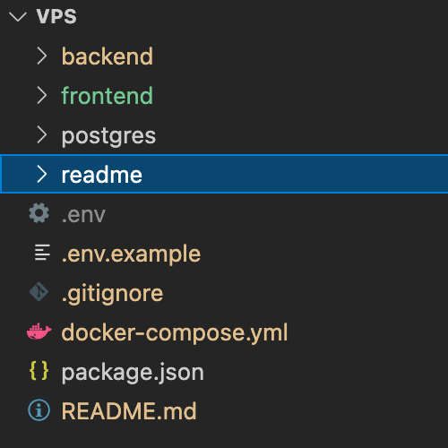

# Description
> Website Stack for jonasleonhard.de, to be deployed via a simple docker compose. 

This Project contains all files required for a strapi cms, next.js frontend and a postgresql database.

## Status
- [x] _in progress_
- [ ] _finished_
- [ ] _no longer continued_ 

*this application is currently beeing developed*

## Table of contents
  - [Description](#description)
  - [Status](#status)
  - [Table of contents](#table-of-contents)
  - [General Info](#general-info)
  - [Screenshots](#screenshots)
  - [Technologies](#technologies)
  - [Setup](#setup)
  - [Known Issues](#known-issues)
## General Info
This Project aims to provide a personal portfolio about me and my work, aswell as a blog where
i write what comes to my mind.
UNDER CONSTRUCTION 🚧
________
</br></br></br>

## Screenshots

| UNDER CONSTRUCTION 🚧 | <br/><br/>

## Technologies
🚧 Main Technologies used in the project: 
* Frontend Service =  Next.js
  - Apollo Client for consuming Strapi's Graphql API
  - Styled Components
  - NProgress Bar
* CMS Service = Strapi 
  - Using Graphql API Plugin
* Postgres Service = Postgresql

## Setup
🚧
[Env] Environment Setup:
- configure the following .env variables:
  (Docker compose) ./.env
  (frontend) ./frontend/.env
  (backend) ./backend/.env

[Docker-compose] To run this project using docker compose
```bash
$ yarn up       # build containers
$ yarn start    # start containers 
$ yarn stop     # stop containers
```

then go to localhost:1337/admin and create a strapi admin account.


[Local] To run this project, install it locally using yarn:
- requirements: setup postgres database's at localhost:5432 -> see defaults at /cms/config/database.js or .env files. You can find the default database requirements in /postgres/1-schema.sql .
```bash
$ cd backend && && yarn && yarn develop
$ cd frontend && yarn && yarn start
```

## Known Issues
🚧🚧🚧🚧
